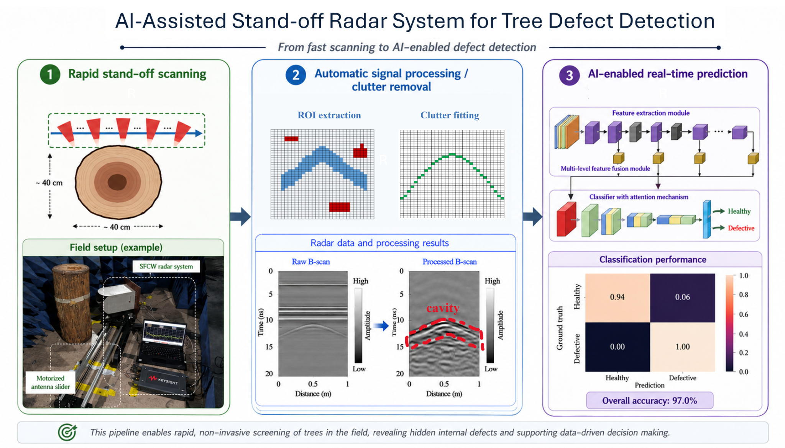

# Jiwei Qian Academic Homepage

Revised modern-light version.

## Preview
Open `index.html` in a browser.

## Deploy with GitHub Pages
1. Create a repository named `jwqian54.github.io`.
2. Upload all files inside this folder to the repository root.
3. In GitHub, open Settings → Pages and select the main branch.
4. The site will be available at `https://jwqian54.github.io`.

## Editing research visuals
The four research panels are built with HTML/CSS so the site works without external image dependencies. They can later be replaced by screenshots from the corresponding papers by replacing the content of each `.research-visual` block with an `` element.


## Updating project images

Project figures are stored in `assets/images/research/`. To replace a project image, copy your new PNG/JPG into that folder and update the corresponding `` path in `index.html`.

For example, Project 1 currently uses:

```html

```

Recommended aspect ratio: 16:9 or close to 16:9. Recommended width: 1400–1800 px for clear display without making the website too heavy.
